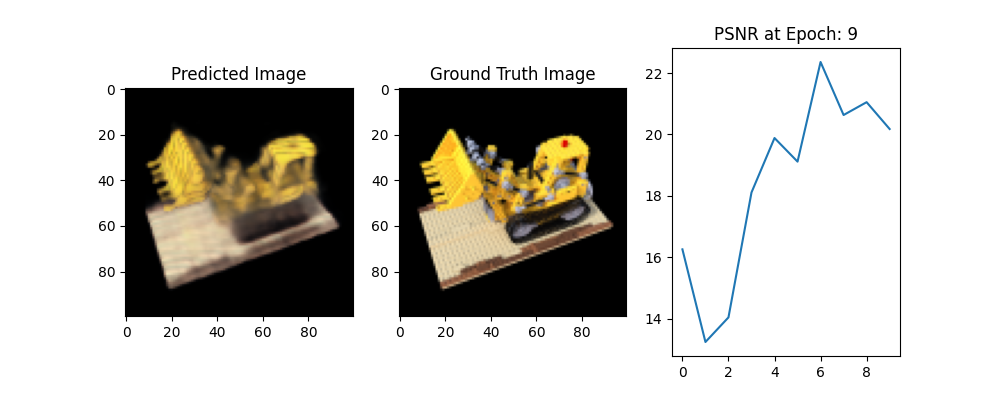

# simple-nerf

Re-implement the original NERF by refering to [tiny_nerf notebook](https://github.com/bmild/nerf/blob/master/tiny_nerf.ipynb).

Small differences:
- Be able to batch multiple images (not just batching rays)
- Add basic unit tests
- Use Pytorch

## Why?

Just want to explore the NERF technology, and the best way to do so is implementing things from "scratch".

## How to Run?

1. `make download`
2. `python train.py`

To run the tests, do `make test`

## Results

Training for 10 epochs, we can get the following results.

